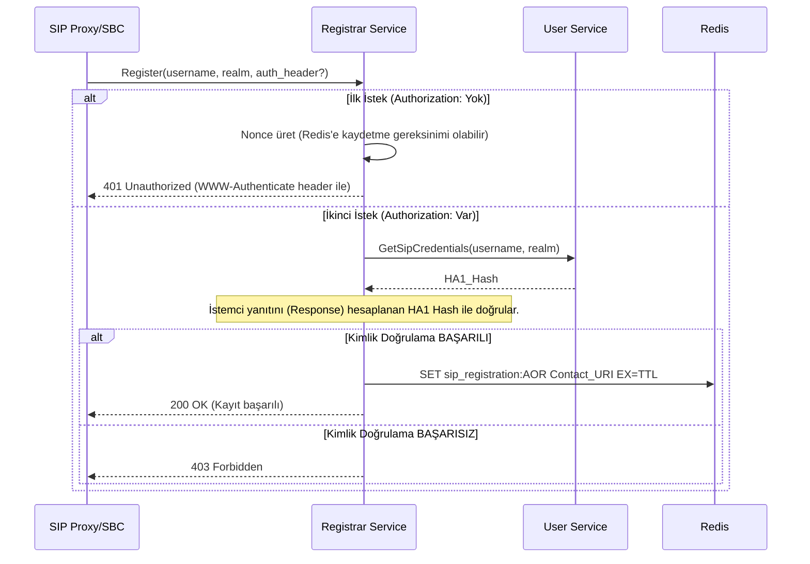
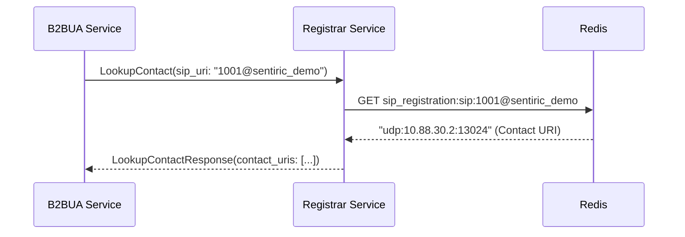

# 📞 Sentiric Registrar Service - Mantık ve Akış Mimarisi

**Belge Amacı:** Bu doküman, `registrar-service`'in SIP REGISTER ve LOOKUP işlemlerini nasıl yürüttüğünü gösteren temel akışı tanımlar.

---

## 1. Stratejik Akış: SIP Uç Nokta Kaydı (REGISTER)

Bir SIP istemcisi (softphone), platformda kullanılabilmek için öncelikle kimliğini kaydetmelidir.

---

## 2. Dizin Arama Akışı (LOOKUP)

İç servislerin, kayıtlı bir uç noktanın IP:Port adresini nasıl bulduğu.

