# 📞 Sentiric Registrar Service - Mantık ve Akış Mimarisi

**Belge Amacı:** Bu doküman, `registrar-service`'in SIP REGISTER ve LOOKUP işlemlerini nasıl yürüttüğünü gösteren temel akışı tanımlar.

---

## 1. Stratejik Akış: SIP Uç Nokta Kaydı (REGISTER)

Bir SIP istemcisi (softphone), platformda kullanılabilmek için öncelikle kimliğini kaydetmelidir.

```mermaid
sequenceDiagram
    participant Proxy as SIP Proxy/SBC
    participant Registrar as Registrar Service
    participant UserDB as User Service
    participant Redis

    Proxy->>Registrar: Register(username, realm, auth_header?)
    
    alt İlk İstek (Authorization: Yok)
        Registrar->>Registrar: Nonce üret (Redis'e kaydetme gereksinimi olabilir)
        Registrar-->>Proxy: 401 Unauthorized (WWW-Authenticate header ile)
    else İkinci İstek (Authorization: Var)
        Registrar->>UserDB: GetSipCredentials(username, realm)
        UserDB-->>Registrar: HA1_Hash
        
        Note over Registrar: İstemci yanıtını (Response) hesaplanan HA1 Hash ile doğrular.
        alt Kimlik Doğrulama BAŞARILI
            Registrar->>Redis: SET sip_registration:AOR Contact_URI EX=TTL
            Registrar-->>Proxy: 200 OK (Kayıt başarılı)
        else Kimlik Doğrulama BAŞARISIZ
            Registrar-->>Proxy: 403 Forbidden
        end
    end
```

---

## 2. Dizin Arama Akışı (LOOKUP)

İç servislerin, kayıtlı bir uç noktanın IP:Port adresini nasıl bulduğu.

